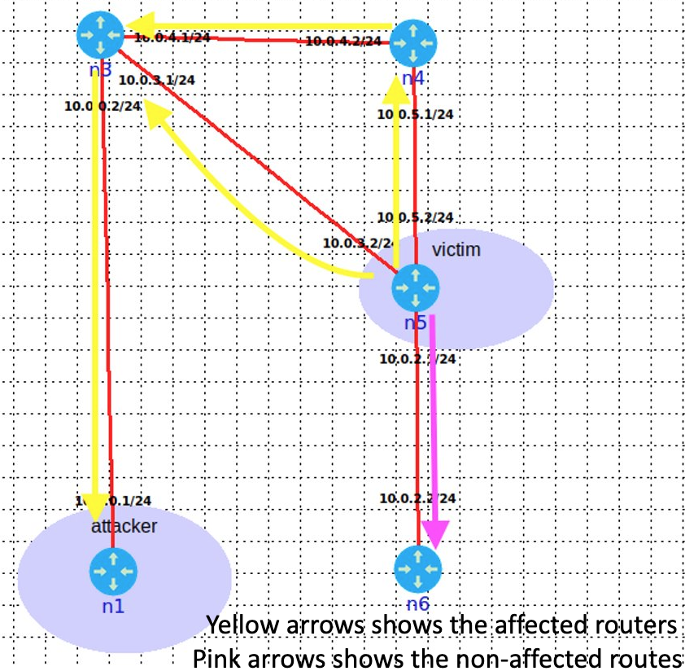
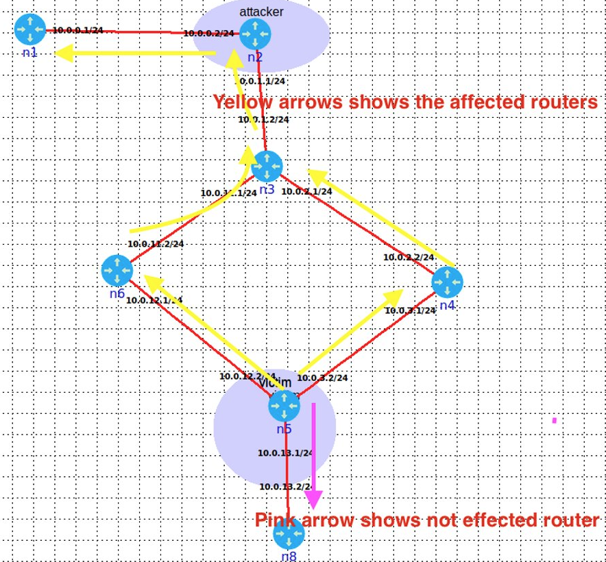

## writter by Anoop Kumar Kushwaha


## DisguiseLSA attack
According to RFC in section 13.1, the instances of an LSA are considered identical if they have the same values in the following three fields; Sequence number, Checksum and Age[5]. Two LSAs are considered identical even if their age field is different by up to 15 minutes and the content of the LSA are different[8]. An attacker exploits this vul- nerability by advertising a disguised LSA that matches a recently generated LSA that has yet to be installed by all routers in the autonomous system. On one hand, the vic- tim won’t generate the fight back packet as the disguised LSA packet matches(disguised lsa packet’s sequence, the checksum is equal to the recently generated LSA packet’s sequence, checksum) the recently generated packet by it- self(victim router will consider the disguised packet to be duplicate). On the other hand, the other routers who have not yet received valid LSA will consider the disguised LSA packet as a valid LSA instance sent by the victim and reject the valid LSA packet(as the router will think the duplicate copy of recently received LSA instance)[8]. Please the fig 5 to get an understanding of how the disguised LSA can be performed.

## Assumptions
    • An attacker has gotten an access to the one of the router on the AS [8]


## Orchestration
```
    1 : We start by intercepting the LSA packet sent by the victim router(n5), where the attacker is location is n5 router( please see the fig.6).
    2 : We created the triggered packet containing false infor- mation(changed the cost of the link between the n5 and n6 router along with the increased sequence number) of the victim LSA instance.
    3 : Next, we crafted the disguised LSA packet via pre- dicting the LSA sequence, checksum and the age of the fight back packet which going to be send by the victim router n5. In our disguised LSA packet, we added a non-existing router(router id: 10.0.2.3) which is neigh- bour to victim router.
    4 : In our last step, we(sending the forged packet the n1 "impersonated" router) first flooded(multicast address 224.0.0.5) the triggered packet on behalf of the victim and then after 1 sec we flooded the disguised packet. The time delay must be followed otherwise the neigh- bors won’t install the packet sent by us as describe by RFC in Architectural Constants[5].
    5 : we tested this attack on two different typologies.
```

## Observer behavior from attack:
We observed that neigh- bours of victim routers except the n6 and n8 routers(shown in fig.6 and fig.7) have installed the disguised LSA sent by us. Each of the poisoned routers now believes that there is a router with an id of 10.0.2.3 exists and it is a neighbour to our victim router(n5). Unlike previous attacks, the attack creates a persistent link which going to stay inside the LSA for 1 hours[5].


## Impacts
    By leveraging this vulnerability, an attacker can attract the large amount of the traffic to non-existing link[8].
    The attacker can repeat it for different victim routers to fully control the topology viewed by the routers in the AS and consequently their routing tables [8]






## Work references
    • Topology 1: https://youtu.be/ysjA13q1kU8
    • Topology 2: https://youtu.be/ysjA13q1kU8

##  To Run
    sudo python3 disg.py -v [victim ip] -n [attacker location] -i [interface]
    Example: sudo python3 disg.py -v 10.0.2.1 -n 10.0.0.1 -i veth6.0.1
