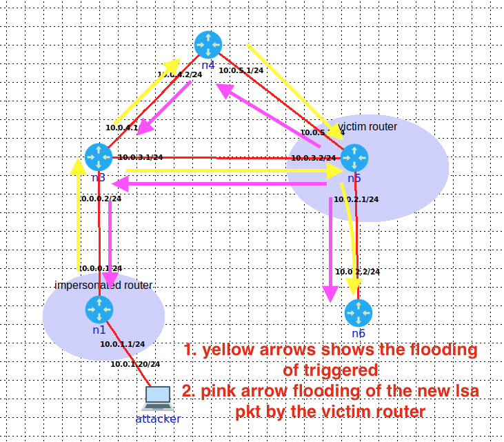

## writter by Anoop Kumar Kushwaha


## Seq++ attack
According to RFC in the section "Architectural Constants", the maximum age that an LSA can be attain is 3600 seconds[5]. And, When the router’s LSA instances reach its maximum age, the router re-flooded its’ LSA to flush the LSA of it from its neighbour and itself from the routing domain[5, 6]. An attack takes the advantage of this design fault, by setting the LS age to max age of an LSA. This will cause the LSA to be flushed by all the routers. The victim router will fight back by issuing a new LSA with the age of 0 and higher sequence number > attacker LSA sequence number[6]. An attacker in this attack, aims to unnecessary flooding and refreshing of the Link State Database, hence making the routing information inconsistent[10]. Further- more, the routers who don’t have a copy of the victim router’s LSA in their Link State Databases will not contribute to the flushing of it[10].

## Assumptions
    • An attacker has gotten an access to the one of the router on the AS [8]


## Orchestration
```
    1 : We started by intercepting the LSA packet sent by the victim router(n5), where we were sitting on the imper- sonated router n1 (figure).
    2 : We craft the forged packet by changing the link state metric of the link between the n5 and n6 router to 30 from 10 and set the LS Age to max 3600 secs(1 hour).
    3 : In our last step, we re-flood(multicast address 224.0.0.5) the crafted packet on behalf of the victim on gap of 1 sec. Note that the time delay must be followed otherwise the neighbors won’t install the packet sent by us as describe by RFC in Architectural Constants[5]
```

## Observer behavior from attack and Imapact:
We observed that neigh- bours of victim routers are installing forged packets, but be- fore installing the forged packet, they are first flushing the current instance LSA(victim’s LSA instance only) from their Link State Database. Eventually, the victim router sends the correct LSA by issuing the new LSA with age to 1 along with the greater sequence than the forged LSA sent by the attacker. Everything is happened as described [5, 6]





## Work references   
    • https://youtu.be/ZYuptBJRhBY


##  To Run
    sudo python3 MaxAgeAttack.py -v [victim ip] -n [attacker location] -i [interface]
    Example: sudo python3 MaxAgeAttack.py -v 10.0.2.1 -n 10.0.0.1 -i veth6.0.1
