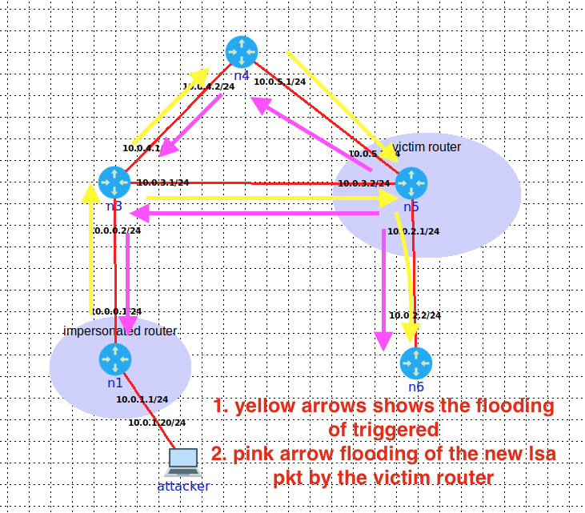

## writter by Anoop Kumar Kushwaha


## Seq++ attack
    According to RFC in section 12.1.6, when the LSA of the router reaches its maximum (0x7FFFFFFF), the current in- stance of the LSA must be flush by setting the LSA age to max (3600) before initiating the new LSA[5]. An attacker ex- ploits this vulnerability by modifying the LSA sequence to its maximum (0x7FFFFFFF) and link state metric. As a result of this victim router should first purge the current installed LSA instance and then flood a new LSA carrying the correct link status information and smallest sequence 0*8000001 to get the acceptance of its LSA from their neighbour (section 12.1.6 in RFC)[5]

## Assumptions
    • An attacker has gotten an access to the one of the router on the AS [8]


## Orchestration
```
    1 : We started by intercepting the LSA packet sent by the victim router(n5), where we were sitting on the imper- sonated router n1.
    2 : We craft the forged packet by changing link state met- ric of the link between the n5 and n6 router to 30 from 10 and set the sequence number to max 0x7FFFFFFF.
    3 : In our last step, we flood(multicast address 224.0.0.5) the crafted LSA packet on the behalf of the victim on gap of 1 sec. The time delay must be followed other- wise the neighbors won’t install the packet sent by us as describe by RFC in Architectural Constants[5].
```

## Observer behavior from attack and Imapact:
    We expected that neigh- bours of victim routers are going install the forged packet and flooding the updated information to their neighbours. Then, the victim router will receives the incorrect informa- tion about itself which causes it to flush the current LSA in- stance with the sequence number 0x7FFFFFFF along with the age 3600 from its routing domain before reissuing the fresh instance of the LSA with the sequence number set to 0*8000001[5]. However, we observed that the router failed to re-issue another packet with the sequence number 0*8000001 after purging out LSA. Another thing we noticed was that, the victim router(n5)(refer to fig3) shutdown af- ter generating the fight packets, which cause the connectivity loss to n6(neighbour router of n5) from others (n4,n3 and n1). We confirm the connectivity lost via pinging the n5 and n6 routers from n4, n3 and n1 routers(please check the below video). A similar result was also observed by Kasemsuwan Visoottiviseth (2017) in their findings[9].





## Work references 
    • https://youtu.be/gCnQ8buN93c


##  To Run
    sudo python3 maxseqscenario_bugfound.py -v [victim ip] -n [attacker location] -i [interface]
    Example: sudo python3 maxseqscenario_bugfound++.py -v 10.0.2.1 -n 10.0.0.1 -i veth6.0.1

